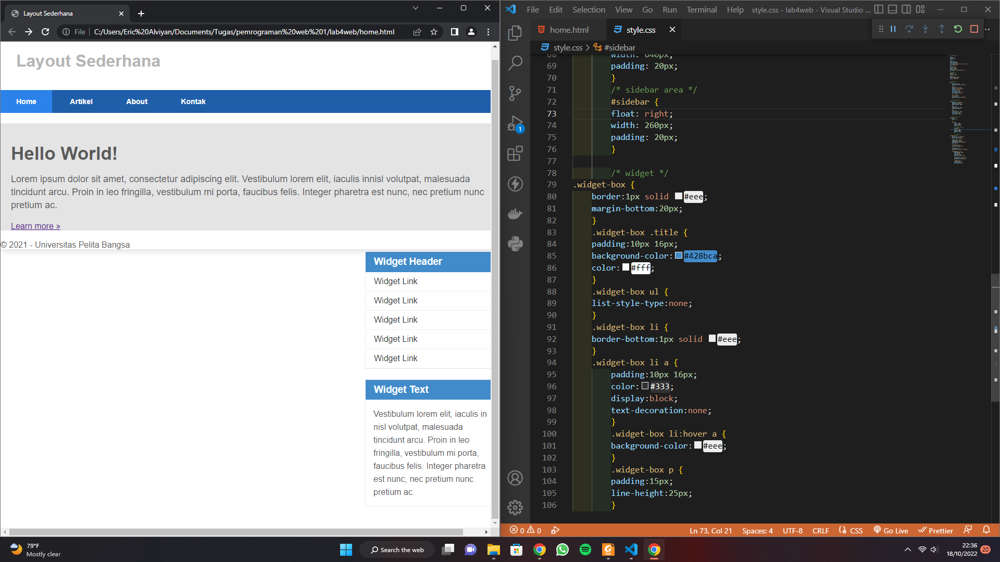

# lab4web
## Membuat Layout Sederhana

### membuat kerangka layout
ini adalah tampilan nya

### menambahkan kode CSS untuk membuat layoutnya
ini adalah tampilan nya

### kemudian selanjutnya mengatur navigasi
ini adalah tampilan nya

### Membuat Hero panel
memasukan kode HTML dan CSS

### Mengatur Layout Main dan Sidebar
ini adalah tampilan nya

### Mengatur Footer
menambahkan kode CSS, ini adalah tampilan nya

### Menambahkan Elemen Pada Main Conten
Menambahkan kode HTML dan CSS, ini adalah tampilan nya

### Membuat Conten Artikel
Menambahkan kode HTML pada Main Content, kemudian tambahkan CSS

